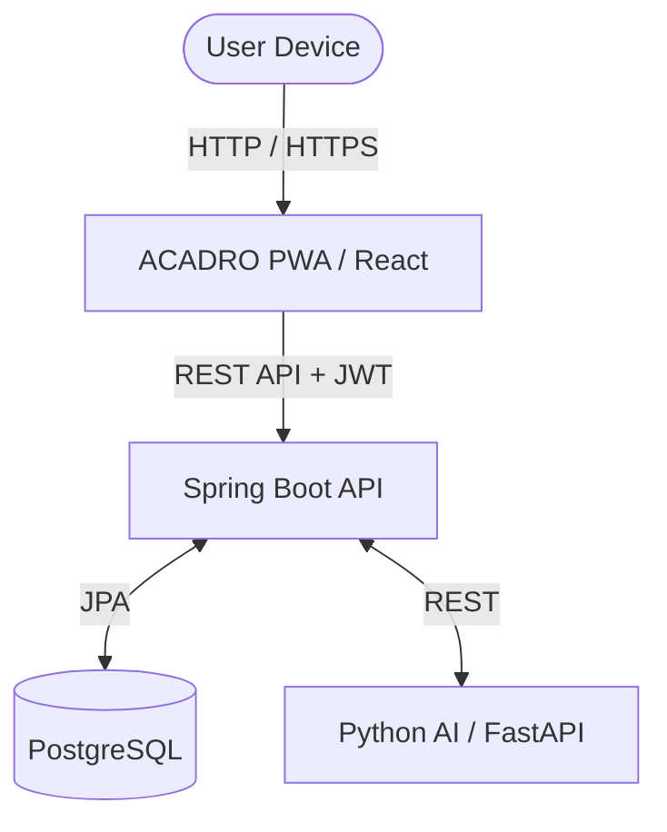
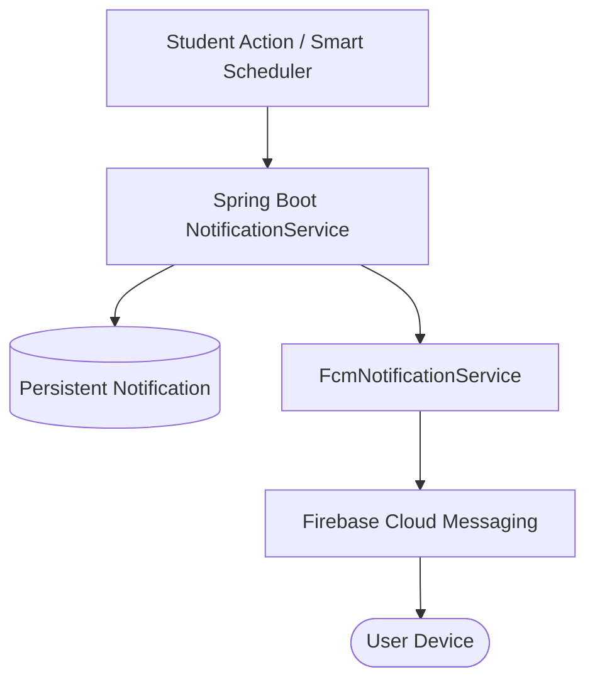

<div align="center">
  
  
  # ACADRO
  **Intelligent Academic & Department Management System**
  
  <p align="center">
    
    
    
    
    
    
  </p>
</div>

---

## 📖 Overview

ACADRO is a centralized, AI-powered academic and department management platform designed to streamline interactions between students, faculty, coordinators, and administrators (HOD). Built with a modular microservices architecture, ACADRO bridges administrative rigor with high-precision artificial intelligence to automate complex academic workflows. 

By bringing together attendance tracking, assignments, quizzes, examinations, events, notices, deadlines, and notifications into a single cohesive platform, ACADRO eliminates the fragmentation of academic data and communication across educational departments.

---

## ✨ Key Features

### 🎓 For Students
- **Smart Dashboard:** Centralized analytics and quick-action hub.
- **Attendance Tracking:** Real-time lecture and laboratory attendance visibility.
- **Academic Workflow:** View active tasks, submit assignments, and attempt quizzes seamlessly.
- **Departmental Updates:** Access event registrations, examination schedules, and department notices.
- **Smart Reminders:** Push notifications and intelligent alerts for approaching deadlines (24h/1h).
- **Study Materials:** Direct access to faculty-uploaded lecture notes and academic resources.

### 👨‍🏫 For Faculty
- **Faculty Dashboard:** Quick visibility into assigned classes, pending evaluations, and daily schedules.
- **Class & Subject Management:** Direct control over assigned academic sections.
- **Evaluations:** Creation, management, and grading of student submissions and quizzes.
- **Interactive Attendance:** Streamlined, robust attendance recording interface.
- **Real-Time Alerts:** Instant notifications when students submit academic deliverables.

### 🏛️ For Administrators (Coordinator / HOD)
- **Academic Administration:** Comprehensive oversight of students, faculty, classes, and sections.
- **AI-Powered Timetables:** Upload, view, and extract departmental timetables using high-precision AI computer vision.
- **Departmental Broadcasts:** Organization and dissemination of department-level events and notices.
- **Event Management:** Monitor event registrations and administrative actions with automated notifications.

---

## 🧠 AI Integration

ACADRO integrates a robust Python/FastAPI microservice to automate tedious data entry:
- **AI Timetable Matching:** High-precision engine powered by LLM parsing and spatial reconstruction.
- **Computer Vision (OCR):** Supports PDF & image extraction for scanned timetables using PaddleOCR and OpenCV.
- **Structured Extraction:** Automatically identifies subjects, faculty, and room allocations.
- **Human-in-the-Loop:** Extracted data is presented in an interactive confirmation UI for validation before database insertion.

---

## 🔔 Notification & PWA Architecture

### Intelligent Notification Flow
- **Persistent Storage:** All notifications are stored in the database with unread counts and direct UI routing.
- **Role-Based Targeting:** Notifications are securely targeted (e.g., assignment submissions alert the specific faculty member).
- **Smart Schedulers:** Automated engine dispatches event and deadline reminders without duplicate spam.
- **Firebase Push Notifications (FCM):** Real-time mobile and desktop push delivery. Device tokens are automatically registered on login and deactivated on logout.

### Progressive Web App (PWA)
ACADRO is fully installable, offering a native-like experience on desktop and mobile:
- **Installable Application:** Add to Home Screen support for iOS, Android, and Desktop.
- **Service Worker:** Offline asset caching using Workbox.
- **Background Sync & Push:** Integrated `firebase-messaging-sw.js` for background FCM delivery (Requires HTTPS in production).

---

## 🏗️ System Architecture

### Component Interaction


### Notification Pipeline


---

## 💻 Technology Stack

| Domain | Technology |
| :--- | :--- |
| **Frontend** | React, TypeScript, Tailwind CSS, Vite |
| **Backend** | Java 17+, Spring Boot, Spring Security, JWT |
| **Database & ORM** | PostgreSQL, Hibernate, Spring Data JPA |
| **AI Microservice** | Python, FastAPI, PaddleOCR, OpenCV |
| **Cloud & PWA** | Firebase Cloud Messaging (FCM), vite-plugin-pwa, Workbox |

---

## 🚀 Getting Started (Local Development)

### Prerequisites
- **Node.js** (v18+) & **npm**
- **Java JDK** 17+ & **Maven**
- **Python** 3.10+
- **PostgreSQL** 14+
- A **Firebase Web Project**

### 1. Database Setup
Create a PostgreSQL database named exactly `acronexus`.
Execute the initialization scripts inside the `db-migration/` folder.

### 2. Environment Variables
Create the necessary environment configuration files (DO NOT commit these to version control).

**Frontend (`frontend/.env`):**
```env
VITE_FIREBASE_API_KEY=your_api_key
VITE_FIREBASE_AUTH_DOMAIN=your_auth_domain
VITE_FIREBASE_PROJECT_ID=your_project_id
VITE_FIREBASE_STORAGE_BUCKET=your_storage_bucket
VITE_FIREBASE_MESSAGING_SENDER_ID=your_sender_id
VITE_FIREBASE_APP_ID=your_app_id
VITE_FIREBASE_VAPID_KEY=your_vapid_key
```

**Backend (`backend/src/main/resources/application.properties`):**
```properties
spring.datasource.password=your_db_password
acronexus.app.jwtSecret=your_jwt_secret_base64
ai.service.base-url=http://localhost:8000
```
*Note: Ensure the Firebase Admin SDK private key JSON file is securely placed in the backend resources directory.*

**AI Service (`ai-services/.env`):**
```env
GROQ_API_KEY=your_groq_api_key
GROQ_MODEL=llama-3.3-70b-versatile
```

### 3. Run the Services

**Backend:**
```bash
cd backend
mvn spring-boot:run
```

**AI Service:**
```bash
cd ai-services
python -m venv venv
source venv/bin/activate  # (Windows: venv\Scripts\activate)
pip install -r requirements.txt
python -m uvicorn app.main:app --reload
```

**Frontend:**
```bash
cd frontend
npm install
npm run dev
```

---

## 🔐 Security & Access Control
- **Role-Based Access Control (RBAC):** Strict enforcement using Spring Security `@PreAuthorize`.
- **Stateless Authentication:** All frontend requests attach a secure JWT token.
- **FCM Token Ownership:** Strict backend checks ensure a device token is solely owned by the authenticated user to prevent notification leaks.

---

## 👨‍💻 Project Information

- **Developer:** Yogita
- **Team:** AcroNexus Academic Team
- **Status:** Core Implementations Complete (v1.0)
- **License:** MIT
